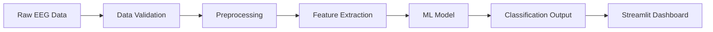

<div align="center">
  <h1> ENIGMA 2.0 — NeuroScan AI</h1>
  <p><strong>EEG-Based Neural Intelligence & Generative Model Analysis</strong></p>
  <p>Advanced brainwave analysis powered by artificial intelligence and machine learning<br>
  Developed by <b>Team GenAI</b> for ENIGMA Hackathon 2.0</p>


[](https://enigma20teamgenai-123.streamlit.app/)
[](https://www.python.org/)
[](https://scikit-learn.org/)
[](https://numpy.org/)

  
</div>

## 👉 **[Access the Live Application Here](https://enigma20teamgenai-123.streamlit.app/)**
---
 
##  Overview
**NeuroScan AI** is an enterprise-grade, AI-powered electroencephalogram (EEG) signal analysis platform engineered by Team GenAI. This sophisticated system leverages state-of-the-art machine learning algorithms to interpret, classify, and derive actionable insights from complex brainwave data patterns.

Developed as part of the ENIGMA 2.0 Hackathon, NeuroScan AI integrates advanced signal processing techniques, comprehensive data validation protocols, and predictive modeling into a seamless, production-ready pipeline designed for scalability and reliability.

###  Use Cases
* **Medical Diagnostics** — Assist healthcare professionals in neurological assessment
* **Cognitive Research** — Support neuroscience research with automated EEG analysis
* **Brain-Computer Interfaces** — Enable real-time brainwave interpretation for BCI applications
* **Mental Health Monitoring** — Track cognitive states and mental wellness indicators

---

## ✨ Key Features

<table>
  <tr>
    <td width="50%">
      <h3> Advanced Analysis</h3>
      <ul>
        <li><b>Multi-Class Classification</b> — Precise categorization of brainwave patterns</li>
        <li><b>Real-Time Processing</b> — Low-latency inference for live EEG streams</li>
        <li><b>Signal Preprocessing</b> — Automated noise reduction and artifact removal</li>
        <li><b>Feature Extraction</b> — Intelligent dimensionality reduction techniques</li>
      </ul>
    </td>
    <td width="50%">
      <h3> Robust Infrastructure</h3>
      <ul>
        <li><b>Production-Ready Model</b> — Pre-trained, validated, and optimized</li>
        <li><b>Data Integrity Pipeline</b> — Comprehensive validation and quality assurance</li>
        <li><b>Interactive Dashboard</b> — Intuitive web interface with real-time visualization</li>
        <li><b>Modular Design</b> — Extensible architecture for custom implementations</li>
      </ul>
    </td>
  </tr>
</table>

---

## Architecture



## Core Components:
- Data Ingestion Layer — Handles multiple EEG data formats
- Validation Module — Ensures data quality and integrity
- ML Engine — Scikit-learn based classification system
- Presentation Layer — Streamlit-powered interactive interface

## Getting Started

### Prerequisites

Ensure your development environment meets the following requirements:

| Requirement          | Version   | Purpose               |
|----------------------|-----------|-----------------------|
| Python               | 3.8+      | Core runtime          |
| pip                  | Latest    | Package management    |
| Virtual Environment  | Recommended | Dependency isolation |
| RAM                  | 4GB+      | Model inference       | 

## Installation

### Step 1: Clone the Repository

```bash
git clone https://github.com/pranay-surya/ENIGMA_2.0__TeamGenAI.git
cd ENIGMA_2.0__TeamGenAI
```

### Step 2: Set Up Virtual Environment

```bash
# Create virtual environment
python -m venv venv

# Activate virtual environment

# On macOS/Linux:
source venv/bin/activate

# On Windows:
venv\Scripts\activate
```

### Step 3: Install Dependencies

```bash
pip install --upgrade pip
pip install -r requirements.txt
```

### Step 4: Verify Installation

```bash
python -c "import streamlit; import sklearn; print('Installation successful!')"
```

---

## Usage

### Launch Web Application

```bash
streamlit run app.py
```

The application will be accessible at:
👉 http://localhost:8501

---

### Run Data Validation Pipeline

```bash
jupyter notebook data_validation.ipynb
```

---

 
## Model Specifications

| Specification       | Details                                    |
| ------------------- | ------------------------------------------ |
| Model Type          | Supervised Classification                  |
| Algorithm           | Ensemble Methods (Random Forest / XGBoost) |
| Input Format        | Preprocessed EEG feature vectors           |
| Output              | Multi-class brainwave state classification |
| Training Dataset    | Validated EEG signal recordings            |
| Performance Metrics | Accuracy, Precision, Recall, F1-Score      |
| Model File          | `eeg_model.pkl` (Serialized Pickle)        |
| Validation          | K-fold cross-validation                    |


## Technology Stack

| Category          | Technology                  | Purpose                                 |
| ----------------- | --------------------------- | --------------------------------------- |
| Core Language     | Python 3.8+                 | Primary development language            |
| Machine Learning  | Scikit-learn, NumPy, Pandas | Model development and data manipulation |
| Web Framework     | Streamlit                   | Interactive web application             |
| Signal Processing | SciPy, MNE-Python           | EEG signal preprocessing                |
| Visualization     | Matplotlib, Plotly          | Data visualization and reporting        |
| Development       | Jupyter Notebook            | Exploratory analysis and validation     |


##  Team

**Team GenAI — ENIGMA Hackathon 2.0 **

| Name               | GitHub Username  | Profile Link                        | Role           |
| ------------------ | ---------------- | ----------------------------------- | -------------- |
| Pranay Suryawanshi | pranay-surya     | https://github.com/pranay-surya     | Lead Developer |
| Bhavesh Hatwar     | Bhatwar195       | https://github.com/Bhatwar195       | Team Member    |
| Bhuvan Bhonde      | BhuvanBhonde712  | https://github.com/BhuvanBhonde712  | Team Member    |
| Nirjara Khante     | nirjarakhante    | https://github.com/nirjarakhante    | Team Member    |
| Sanskruti Harne    | SanskrutiHarne72 | https://github.com/SanskrutiHarne72 | Team Member    |

